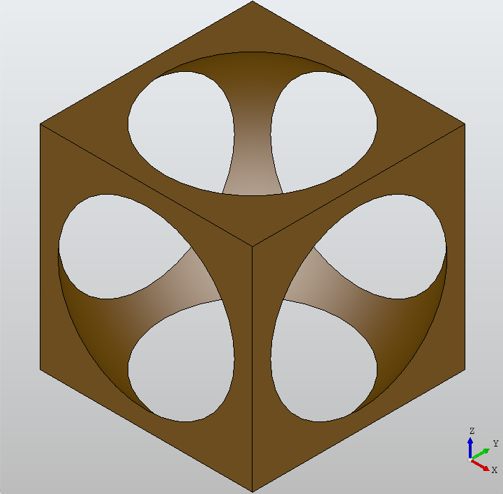

# csgstep

A constructive solid geometry python library for OpenCASCADE.  The API is based on the OpenSCAD and SolidPython API.  The library can read and write STEP files.

## Examples

Create a cube that has a sphere subtracted from it:

```python
from csgstep import cube, sphere
solid = cube(center=True) - sphere(.65)
solid.write_stl('cube.stl')    
solid.write_step('cube.stp')    
```

Create a helix:

```python
from csgstep import circle
pitch = .3
solid = circle(.1)
solid = solid.helix_extrude(r=8, h=3.1 * pitch, pitch=pitch, center=True)
solid.write_stl('helix.stl')    
solid.write_step('helix.stp')    
```
        
Create a pipe:

```python
from csgstep import circle
solid = circle(.2).spline_extrude([(0, 0, 0),(0, 1, 2),(0, 2, 3)])
solid.write_stl('pipe.stl')    
solid.write_step('pipe.stp')    
```

## Dependencies

The library depends on pythonocc-core and numpy.  To install pythonocc-core, I used anaconda and ran "conda install -c conda-forge pythonocc-core".

To install csgstep run "pip install ." in this directory, or the equivalent.  It will bring in numpy.

## Notes

All method functions (not properties) of Solid return a new Solid object.  So remember to always 
assign the result of a method or method chain, otherwise it will be lost.

The rotate method here is different from the OpenSCAD rotate method.  The first argument is the angle to rotate and the second argument is the vector to rotate around.

I also added a new extrude method called spline_extrude.  It takes a list of points as its only argument.  These points are converted into a cubic spline which is then used to extrude a solid.  An example of spline_extrude is the helix_extrude method which creates a helix from a solid.

## csgstep API

<code>csgstep.<b>load\_step</b>(filename)</code>  
Load the given STEP File.  
**filename** the path of the STEP file  
**returns** a Solid object  

<code>csgstep.<b>sphere</b>(r=1)</code>  
Create a sphere of the given radius centered at the origin.  
**r** the radius of the sphere  
**returns** a Solid object  

<code>csgstep.<b>cube</b>(s=1, center=False)</code>  
Create a cube of the given size.  
**s** the length of the sides of the cube as a real or 3D vector  
**center** if true center the cube at the origin, otherwise the lowest edge of the cube is at the origin  
**returns** a Solid object  

<code>csgstep.<b>wedge</b>(s=1, xmin=0, zmin=0, xmax=0, zmax=0)</code>  
Create a wedge of the given size and given the face at dy.  
**s** the length of the sides of the wedge as a real or 3D vector  
**xmin** the minimum value of x at dy  
**zmin** the minimum value of z at dy  
**xmax** the maximum value of x at dy  
**zmax** the maximum value of z at dy  
**returns** a Solid object  

<code>csgstep.<b>cylinder</b>(r=1, h=1, center=False)</code>  
Create a cylinder along the Z axis of the given radius and height  
**r** the radius of the cylinder  
**h** the height of the cylinder  
**center** if true center the cylinder on the Z axis, otherwise the base is at the origin  
**returns** a Solid object  

<code>csgstep.<b>cone</b>(r1=1, r2=0, h=1, center=False)</code>  
Create a cone along the Z axis of the given base radius, top radius, and height  
**r1** the bottom radius of the cone  
**r2** the top radius of the cone  
**h** the height of the cone  
**center** if true center the cone on the Z axis, otherwise the base is at the origin  
**returns** a Solid object  

<code>csgstep.<b>circle</b>(r=1)</code>  
Create a 2D face of a circle for the given radius centered at the origin in the XY plane.  
**r** the radius of the circle  
**returns** a Solid object  

<code>csgstep.<b>ellipse</b>(rx=1, ry=1)</code>  
Create a 2D face of a ellipse for the given X radius and Y radius centered at the origin in the XY plane.  
**rx** the radius of the ellipse in the X axis direction  
**ry** the radius of the ellipse in the Y axis direction  
**returns** a Solid object  

<code>csgstep.<b>square</b>(s=1, center=False)</code>  
Create a 2D face of a square for the given size in the XY plane.  
**s** the length of the sides of the square as a real or 2D vector  
**center** if true center the square at the origin, otherwise one edge is at the origin  
**returns** a Solid object  

<code>csgstep.<b>polygon</b>(points)</code>  
Create a 2D face of a polygon from 2D points in the XY plane.  
**points** the points of the polygon in path order  
**returns** a Solid object  

<code>class csgstep.<b>Solid</b>(self, shape=None)</code>  
Instantiate Solid class with a TopoDS object.  
**shape** the TopoDS object to wrap the instantiated class around  

Instances of the <code>csgstep.<b>Solid</b></code> class have the following methods:   

<code>Solid.<b>shape</b></code>
Return the TopoDS object this Solid object wraps.  
**returns** the underlying TopoDS object  

<code>Solid.<b>write\_step</b>(self, filename, schema='AP203')</code>  
Write this solid to a STEP file.  
**filename** name of STEP output file  
**schema** name of STEP output schema, defaults to AP203  

<code>Solid.<b>write\_stl</b>(self, filename, mode='ascii', linear\_deflection=0.5, angular\_deflection=0.25)</code>  
Write this solid to a STL file.  
**filename** name of STL output file  
**mode** mode of STL file, whether ascii or binary  
**linear\_deflection** linear deflection value  
**angular\_deflection** angular deflection value  

<code>Solid.<b>\_\_add\_\_</b>(self, solid)</code>  
Redirects call to the union method.

<code>Solid.<b>\_\_mul\_\_</b>(self, solid)</code>  
Redirects call to the intersection method.

<code>Solid.<b>\_\_sub\_\_</b>(self, solid)</code>  
Redirects call to the difference method.

<code>Solid.<b>mirrorX</b>(self)</code>  
Mirror this solid about the X axis.  
**returns** a new Solid object  

<code>Solid.<b>mirrorY</b>(self)</code>  
Mirror this solid about the Y axis.  
**returns** a new Solid object  

<code>Solid.<b>mirrorZ</b>(self)</code>  
Mirror this solid about the Z axis.  
**returns** a new Solid object  

<code>Solid.<b>rotateX</b>(self, a)</code>  
Rotate this solid around the X axis by the given angle.  
**a** the angle to rotate by  
**returns** a new Solid object  

<code>Solid.<b>rotateY</b>(self, a)</code>  
Rotate this solid around the Y axis by the given angle.  
**a** the angle to rotate by  
**returns** a new Solid object  

<code>Solid.<b>rotateZ</b>(self, a)</code>  
Rotate this solid around the Z axis by the given angle.  
**a** the angle to rotate by  
**returns** a new Solid object  

<code>Solid.<b>translateX</b>(self, v)</code>  
Translate this solid in the X direction by the given amount.  
**v** the amount to translate object by  
**returns** a new Solid object  

<code>Solid.<b>translateY</b>(self, v)</code>  
Translate this solid in the Y direction by the given amount.  
**v** the amount to translate object by  
**returns** a new Solid object  

<code>Solid.<b>translateZ</b>(self, v)</code>  
Translate this solid in the Z direction by the given amount.  
**v** the amount to translate object by  
**returns** a new Solid object  

<code>Solid.<b>union</b>(self, solid)</code>  
Union this solid with another Solid object.
The openCASCADE BOPAlgo\_MakerVolume function is used to perform the union.  
**solid** the Solid object to merge with  
**returns** a new Solid object  

<code>Solid.<b>intersection</b>(self, solid)</code>  
Intersect this solid with the given Solid object.  
**solid** the Solid object to intersect with  
**returns** a new Solid object  

<code>Solid.<b>difference</b>(self, solid)</code>  
Cut the given Solid object from this solid.  
**solid** the Solid object to cut with  
**returns** a new Solid object  

<code>Solid.<b>fuse</b>(self, solid)</code>  
Fuse this solid with the given Solid object.
The openCASCADE BRepAlgoAPI\_Fuse function is used to perform the fusion.  
**solid** the Solid object to merge with  
**returns** a new Solid object  

<code>Solid.<b>compound</b>(self, *solid)</code>  
Create a compound shape with this solid and the given Solid objects.
More than one Solid objects can be passed as arguments for compounding.
The method creates a openCASCADE TopoDS\_Compound shape from the shapes.
:param *solid the Solid objects to create a compound shape from  
**returns** a new Solid object with the TopoDS\_Compound shape  

<code>Solid.<b>mirror</b>(self, v)</code>  
Mirror this solid about the given axis.  
**v** the 3D vector to mirror object about  
**returns** a new Solid object  

<code>Solid.<b>translate</b>(self, v)</code>  
Translate this solid by the given 3D vector.  
**v** the 3D vector to translate object with  
**returns** a new Solid object  

<code>Solid.<b>rotate</b>(self, a, v)</code>  
Rotate this solid around the given 3D vector by the given angle.  
**a** the angle to rotate object  
**v** the 3D vector to rotate object around  
**returns** a new Solid object  

<code>Solid.<b>scale</b>(self, v)</code>  
Scale this solid by the given factor.  
**v** the factor to scale, given as a real or 3D vector  
**returns** a new Solid object  

<code>Solid.<b>fillet</b>(self, r)</code>  
Fillet all edges of the solid by the given radius.  
**radius** the radius to fillet edges by  
**returns** a new Solid object  

<code>Solid.<b>chamfer</b>(self, d)</code>  
Chamfer all edges of the solid by the given distance.  
**d** the distance to chamfer edges by  
**returns** a new Solid object  

<code>Solid.<b>draft</b>(self, a)</code>  
Apply a draft angle to all vertical faces of the solid.
The vertical direction is used to measure the draft angle.
The neutral plane is the XY plane at the origin.  
**a** the draft angle to apply  
**returns** a new Solid object  

<code>Solid.<b>linear\_extrude</b>(self, v)</code>  
Linear extrude this 2D face in the Z direction by the given amount.  
**v** the amount to linear extrude by  
**returns** a new Solid object  

<code>Solid.<b>rotate\_extrude</b>(self, a=None)</code>  
Rotate extrude this 2D face around the Z axis by the given angle.
The object will be rotated around the X axis by 90 degrees before being extruded.  
**a** the angle to rotate extrude by, defaults to 360 degrees  
**returns** a new Solid object  

<code>Solid.<b>spline\_extrude</b>(self, points)</code>  
Spline extrude this 2D face along a cubic spline given by 3D points.  
**points** the 3D points to create the cubic spline from   
**returns** a new Solid object  

<code>Solid.<b>helix\_extrude</b>(self, r, h, pitch, center=False)</code>  
Helix extrude this 2D face by the given radius, height and pitch.  
**radius** the radius of the helix  
**height** the height of the helix  
**pitch** the pitch of the helix  
**center** if true center the helix on the Z axis, otherwise base is at the origin  
**returns** a new Solid object  


